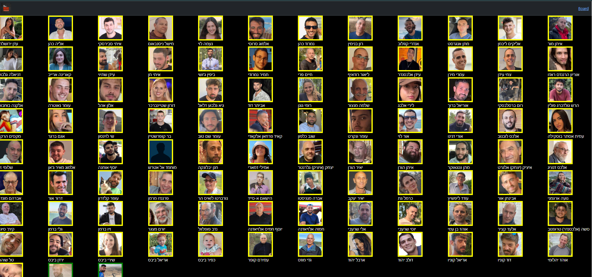
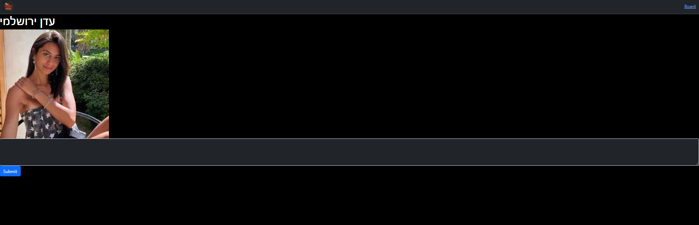
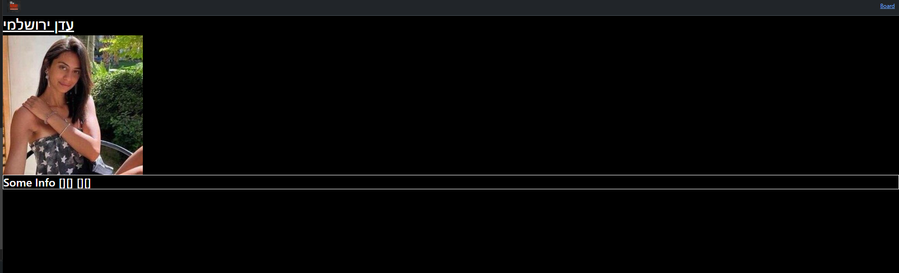

HostageMessaging is a web app design to be on touch screens in my school's lobby, the application allow students to choose a hostage and write a small paragraph about him, then other student would be able to see what other studets wrote about each hostage and by that to make student learn about the hostages in a unique way.

This is the main board.

after choosing a yellow image, the student will see this form:

The student will be able to write information about the hostage and submit it.

then in the main board the hostage image border will be green, and if a student will click it he will see this:

